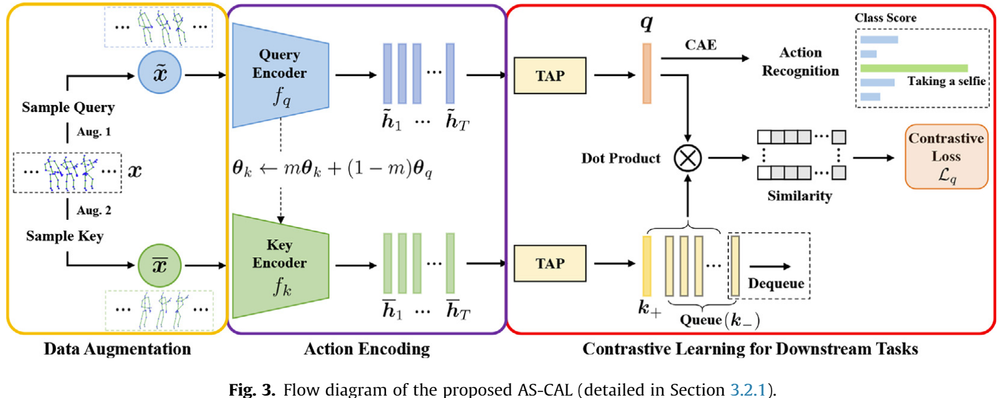
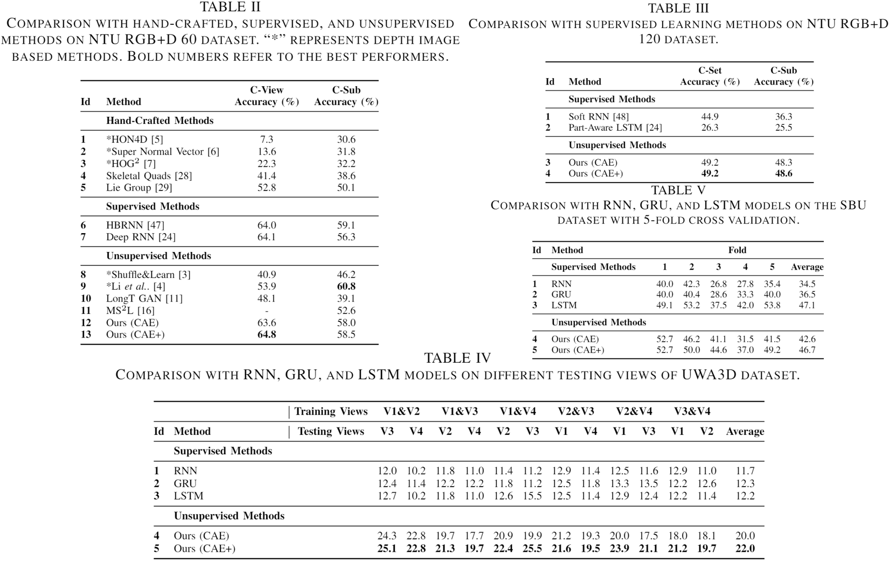

# AS-CAL

Please visit [AS-CAL](https://github.com/LZU-SIAT/AS-CAL) to pull the latest version of this project.

## Introduction
This is the official implementation of "Augmented Skeleton Based Contrastive Action Learning with Momentum LSTM for Unsupervised Action Recognition". (By Haocong Rao, Siqi Wang, Xiping Hu, Mingkui Tan, Huang Da, Jun Cheng, Bin Hu). In [Information Sciences 2021](https://www.sciencedirect.com/science/article/abs/pii/S0020025521003443).



Abstract: Action recognition via 3D skeleton data is an emerging important topic. Most existing methods rely on hand-crafted descriptors to recognize actions, or perform supervised action representation learning with massive labels. In this paper, we for the first time propose a contrastive action learning paradigm named AS-CAL that exploits different augmentations of unlabeled skeleton sequences to learn action representations in an unsupervised manner. Specifically, we first propose to contrast similarity between augmented instances of the input skeleton sequence, which are transformed with multiple novel augmentation strategies, to learn inherent action patterns (“pattern-invariance”) in different skeleton transformations. Second, to encourage learning the pattern-invariance with more consistent action representations, we propose a momentum LSTM, which is implemented as the momentum-based moving average of LSTM based query encoder, to encode long-term action dynamics of the key sequence. Third, we introduce a queue to store the encoded keys, which allows flexibly reusing proceeding keys to build a consistent dictionary to facilitate contrastive learning. Last, we propose a novel representation named Contrastive Action Encoding (CAE) to represent human’s action effectively. Empirical evaluations show that our approach significantly outperforms hand-crafted methods by 10–50% Top-1 accuracy, and it can even achieve superior performance to many supervised learning methods.

## Requirements
- Python 3.6
- Pytorch 1.0.1
## Datasets
- NTU RGB+D 60:  
Download raw data from https://github.com/shahroudy/NTURGB-D  
Use `st-gcn/tools/ntu_gendata.py` in https://github.com/yysijie/st-gcn to prepare data
- NTU RGB+D 120:  
Same as NTU RGB+D 60 but needs some modification for NTU RGB+D 120.
- SBU, UWA3D, N-UCLA  
Unzip the `.zip` file in `/data` and put them into the directory corresponding to the one in codes.


## Usage
- pretrain and then linear evaluation:  
  `python  pretrain_and_linEval.py`

- reload pre-trained models and linear evaluation:  
`python linEval.py --mode eval --model_path ./pretrained_model.pth`

- supervised:  
`python linEval.py --mode supervise`

- reload pre-trained models and semi-supervised:  
`python linEval.py --mode semi --model_path ./pretrained_model.pth`

For more customized parameter settings, you can change them in `parse_option()` and/or `parse_option_lin_eval()` 

## Tips  
To debug, we suggest to set `epochs` to 2 and `save_freq` to 1 in `parse_option()`.  
Besides, we suggest to set `epochs` to 1 in `parse_option_lin_eval()`.


## Results


## Citation
If you find this code useful for your research, please cite our paper
```bash
@article{RAO202190,
title = {Augmented Skeleton Based Contrastive Action Learning with Momentum LSTM for Unsupervised Action Recognition},
journal = {Information Sciences},
volume = {569},
pages = {90-109},
year = {2021},
issn = {0020-0255},
doi = {https://doi.org/10.1016/j.ins.2021.04.023},
url = {https://www.sciencedirect.com/science/article/pii/S0020025521003443},
author = {Haocong Rao and Shihao Xu and Xiping Hu and Jun Cheng and Bin Hu},
}
}
```

## License
AS-CAL is released under the MIT License.
